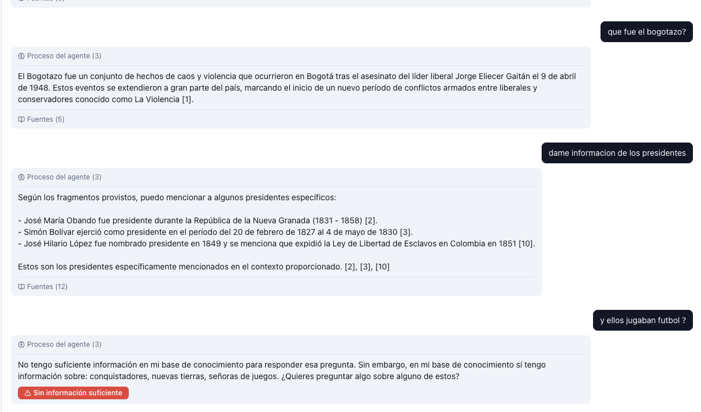
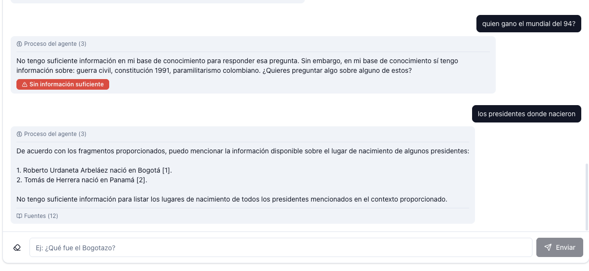

# Documento Técnico — Rag · Historia de Colombia

## 1. Nombre del proyecto
**Rag · Historia de Colombia** — Agente inteligente con Retrieval-Augmented Generation sobre
literatura y artículos de historia colombiana.

## 2. Integrantes
- Luis Rodríguez
- Simón Gómez

## 3. Tema seleccionado
**Historia de Colombia.** Cubre eventos, personajes y procesos políticos/sociales del país,
desde la conquista y la Independencia hasta la historia republicana del siglo XX.

## 4. Descripción del problema
El conocimiento histórico de Colombia está disperso entre enciclopedias, libros académicos y
artículos en línea. Para un estudiante o investigador es engorroso consultar varios documentos
para responder una pregunta puntual con respaldo bibliográfico. Este proyecto entrega un agente
que **responde con base en documentos cargados** por el propio usuario y se niega a inventar
información cuando no tiene contexto suficiente — y en ese caso le sugiere al usuario sobre
qué temas SÍ podría preguntar.

## 5. Arquitectura general
Cliente React (con autenticación OIDC) ↔ API REST + SSE en FastAPI ↔ Agente LangGraph ↔
pgvector + Ollama. Cuatro componentes corren como servicios Docker en la misma red interna
(`db`, `keycloak`, `backend`, `frontend`); **Ollama corre en el host de macOS** para usar
GPU vía Metal.

## 6. Diagrama de arquitectura
Ver `docs/arquitectura.md`.

## 7. Tecnologías utilizadas

| Capa | Tecnología | Versión / notas |
|---|---|---|
| Frontend | React + Vite + TypeScript + Tailwind + shadcn/ui | 18 / 5.4 / 5.6 |
| Auth (cliente) | keycloak-js | 25 |
| Backend | FastAPI + Pydantic v2 + SQLAlchemy 2 async | 0.115 / 2.9 / 2.0 |
| Streaming | FastAPI `StreamingResponse` (Server-Sent Events) | — |
| Agente | LangChain + LangGraph | 0.3 / 0.2 |
| LLM | Ollama · `qwen2.5:14b-instruct-q5_K_M` (~10 GB, 100 % GPU) | latest |
| Embeddings | Ollama · `bge-m3` (1024 dim, multilingüe) | latest |
| Vector store | Postgres 16 + pgvector (`VECTOR(1024)`, índice ivfflat cosine) | 16 / 0.7 |
| Auth (servidor) | Keycloak | 25.0 |
| Orquestación | Docker Compose | v2 |

## 8. Descripción del backend
- **Framework:** FastAPI con `lifespan` para inicializar el esquema (sin Alembic).
- **Endpoints:**
  - `GET /health`
  - `GET /auth/me`
  - `POST /documents`, `GET /documents`, `DELETE /documents/{id}`
  - `POST /chat` — respuesta no-streaming
  - `POST /chat/stream` — **respuesta en streaming SSE con trazabilidad de nodos**
  - `GET /chat/history`
- **Seguridad:** todos los endpoints excepto `/health` exigen `Authorization: Bearer <JWT>`. El
  token se valida contra el JWKS de Keycloak con cache TTL.
- **Errores uniformes:** `app/core/exceptions.py` define la jerarquía `AppError`
  (`InvalidJWT`, `DocumentNotFound`, `UnsupportedFileType`, `EmbeddingError`,
  `LLMUnavailable`, …) y los handlers que producen `{code, message, details}`.

## 9. Descripción del frontend
- SPA en React + Vite, estilada con Tailwind y componentes shadcn/ui.
- Tres páginas: `LoginPage` (con autores), `ChatPage`, `DocumentsPage`.
- `Header` con navegación entre Chat y Documentos y **botón "Cerrar sesión"** siempre visible.
- Interceptor de axios refresca el token en cada request y registra los 401 en consola.
- **Chat con streaming**: usa `fetch` + ReadableStream para consumir SSE
  (no `EventSource` porque no permite enviar `Authorization` con `POST`). Los tokens del LLM
  aparecen en vivo y por encima de la respuesta se renderiza la **trazabilidad de nodos**
  del agente (spinner → check con metadata).

## 10. Descripción del agente
Grafo en LangGraph con tres nodos efectivos:

1. **`retrieve`** — embebe la pregunta con `bge-m3` y consulta los top-k chunks por
   similitud coseno en pgvector. Devuelve tanto la lista completa (`candidates`) como la
   filtrada por umbral (`retrieved`); el camino de rechazo usa la primera para sugerir temas.
2. **`classify`** — *una sola* llamada al LLM que decide si el contexto filtrado es relevante
   y, en caso negativo, lista 2–4 temas del corpus que el usuario sí podría consultar. El
   contrato del prompt obliga al modelo a responder con `YES` o `NO: tema 1; tema 2; tema 3`.
   Si `retrieved` está vacío se corta el camino y se salta esta llamada por completo.
3. **`decide_route`** (arista condicional) — si `is_relevant == False` enruta a
   `refuse_with_topics`; si es `True`, a `generate`.
4. **`generate`** — produce la respuesta con `qwen2.5:14b-instruct-q5_K_M` y la
   **streamea token a token** vía `ChatOllama.astream`. Prompt centrado en sintetizar sin
   inventar; permite resúmenes y visiones generales para preguntas amplias.

Adicionalmente, **antes de invocar el grafo** el route fetcha los últimos `CHAT_HISTORY_TURNS=3`
(pregunta, respuesta) pares del usuario desde Postgres y los inyecta como `state["history"]`.
Tanto `classify` como `generate` los reciben en sus prompts para resolver follow-ups con
pronombres o referencias ambiguas ("y él?", "ese", "el primero de ellos"). La recuperación
sigue embebiendo sólo la pregunta actual — la historia afecta interpretación, no qué chunks
se pulen del vector store.
5. **`refuse_with_topics`** — ensambla, sin llamar al LLM, el mensaje canónico de rechazo
   seguido de la lista de temas extraídos en `classify`.

> El diseño anterior tenía cinco llamadas al LLM por pregunta (`grade_documents` per-chunk +
> `grade_generation` grounding-check). Se observó que esa cadena rechazaba en exceso preguntas
> conversacionales/amplias ("háblame de Colombia"). Se consolidó en **una sola compuerta
> `classify`** y se confía en el prompt de `generate` para no inventar hechos concretos.

## 11. Flujo de LangGraph

```
START → retrieve → classify → decide_route
                              ├── refuse_with_topics → END
                              └── generate (stream)  → END
```

## 12. Flujo end-to-end de una pregunta (lo que pasa al pulsar "Enviar")

```
Frontend                Backend                  LangGraph / Ollama / Postgres
────────                ───────                  ──────────────────────────────
1. Usuario escribe   →  POST /chat/stream
   y envía              Authorization: Bearer JWT
                        body: {"question": "..."}

                        2. Validar JWT vs JWKS (cache TTL)
                        3. Abrir StreamingResponse (text/event-stream)
                        4. Iterar `run_agent_stream(question)`:

                                                  ── retrieve ──
                                                  · bge-m3 embebe la pregunta → vector 1024-d
                                                  · pgvector `<=>` cosine, top-k (5)
                        ◄── data: {type:"node_start", node:"retrieve"}
                        ◄── data: {type:"node_end",   node:"retrieve",
                                   meta:{kept,candidates,top_similarity}}

                                                  ── classify ──
                                                  · si retrieved=[] → salta LLM, is_relevant=false
                                                  · si no → 1 LLM call a qwen2.5:14b
                                                    parser: YES | NO: t1; t2; t3
                        ◄── data: {type:"node_start", node:"classify"}
                        ◄── data: {type:"node_end",   node:"classify",
                                   meta:{is_relevant, topics}}

                                                  ── branch ──
                       a) is_relevant = true:
                                                  ── generate (streaming) ──
                                                  · ChatOllama.astream(ANSWER_PROMPT)
                                                  · tokens emitidos en cuanto llegan
                        ◄── data: {type:"node_start", node:"generate"}
                        ◄── data: {type:"token", value:"Bolí"}
                        ◄── data: {type:"token", value:"var "}
                        ◄── ...
                        ◄── data: {type:"node_end", node:"generate", meta:{chars}}
                        ◄── data: {type:"done", answer, grounded:true, sources:[...]}

                       b) is_relevant = false:
                                                  ── refuse_with_topics ──
                                                  · ensambla refusal + topics (sin LLM)
                        ◄── data: {type:"node_start", node:"refuse_with_topics"}
                        ◄── data: {type:"token", value:"<mensaje + sugerencias>"}
                        ◄── data: {type:"node_end", node:"refuse_with_topics"}
                        ◄── data: {type:"done", answer, grounded:false, sources:[]}

                        5. Tras `done`, persistir el turno en `chat_messages`
                           (commit a Postgres) y cerrar el stream.

6. Frontend procesa     ◄── stream cerrado
   eventos en vivo:
   · node_start  → añade paso "running" a la lista de trazabilidad
   · node_end    → marca paso como "done" + meta visible
   · token       → concatena al bubble de la respuesta
   · done        → fija answer/grounded/sources finales y persiste en localStorage
```

### Tiempos típicos en frío vs. en caliente

| Tramo | Frío (primer prompt tras boot) | Caliente |
|---|---|---|
| Validación JWT (JWKS fetch inicial) | ~1–3 s | < 50 ms (cache) |
| `bge-m3` cargando a VRAM | ~3–6 s | 0 (en VRAM) |
| `retrieve` (embed + búsqueda) | ~1 s | ~300 ms |
| `classify` (1 LLM call) | ~3–4 s (warm-up qwen) | ~1–2 s |
| `generate` (streaming) | primer token ~3 s, ~30–50 tok/s | primer token < 1 s, ~30–50 tok/s |
| `refuse_with_topics` | < 100 ms (sin LLM) | < 100 ms |

`OLLAMA_KEEP_ALIVE=30m` mantiene los modelos calientes en VRAM entre peticiones.

## 13. Modelo local utilizado

**Qué:** `qwen2.5:14b-instruct-q5_K_M` (Alibaba, 14 B parámetros, cuantización Q5_K_M, ~10 GB en VRAM) mediante Ollama corriendo en el host macOS.

**Por qué:**
- Excelente instruction-following — sigue reglas estrictas del prompt sin alucinar (clave para el control anti-hallucination).
- Soporte fuerte de español, mejor que llama3.1:8b para nuestro corpus.
- La cuantización Q5_K_M es el sweet spot: ~5–8 % mejor calidad que Q4_K_M con apenas ~10 % menos de throughput, y cabe holgadamente en GPU de Apple Silicon con 24–32 GB de memoria unificada.
- 14 B parámetros es el tope práctico de los modelos "abiertos" que corren con baja latencia interactiva en hardware de consumo Apple Silicon.

**Cómo se ejecuta:**
```bash
ollama pull qwen2.5:14b-instruct-q5_K_M
ollama pull bge-m3
docker compose up -d --build       # backend conecta via host.docker.internal:11434
```

**Parámetros runtime configurables vía `.env`:**

| Variable | Valor | Propósito |
|---|---|---|
| `OLLAMA_LLM_MODEL` | `qwen2.5:14b-instruct-q5_K_M` | Modelo activo |
| `OLLAMA_NUM_CTX` | `16384` | Ventana de contexto (default Ollama es 2048 — insuficiente para RAG con 12 chunks) |
| `OLLAMA_KEEP_ALIVE` | `30m` | Tiempo que el modelo permanece en VRAM tras la última petición |
| `RAG_TOP_K` | `12` | Cuántos chunks recupera pgvector por pregunta |
| `RAG_SIMILARITY_THRESHOLD` | `0.25` | Umbral coseno mínimo para que un chunk pase el filtro |
| `CHAT_HISTORY_TURNS` | `3` | Últimos turnos pregunta/respuesta inyectados en classify + generate |

**Limitaciones encontradas:**

- **Latencia en frío:** primer prompt tras boot del contenedor o tras descargar el modelo paga ~5–15 s de carga a VRAM. `keep_alive=30m` evita pagarlo en cada pregunta.
- **Velocidad de token:** ~25–35 tok/s en M-series con `num_ctx=16384`. Respuestas largas (>200 palabras) tardan 5–10 s en completarse. Aceptable para conversación pero no para tiempo real estricto.
- **Hallucinations con disclaimers:** incluso con prompt restrictivo, qwen2.5 puede filtrar conocimiento paramétrico envuelto en frases como *"aunque no se menciona en tu contexto, X..."*. Fue necesario endurecer `ANSWER_PROMPT` con prohibiciones explícitas y ejemplos textuales de esas frases trampa.
- **Dependencia de GPU local:** la arquitectura asume Ollama en host con Metal/GPU. Mover a un host sin GPU exige cambiar la `OLLAMA_BASE_URL` a un servicio gestionado (e.g. Ollama Cloud, Groq) o aceptar latencias de 30 s+ por respuesta en CPU.

Verificable en cualquier momento con `ollama ps`; la columna `PROCESSOR` debe decir `100% GPU` y `CONTEXT 16384`.

## 14. Embeddings
- **`bge-m3`** (BAAI, 1024-dim, multilingüe nativo). Reemplazó a `nomic-embed-text` (768-dim,
  inglés-céntrico) por su rendimiento sustancialmente mejor en consultas en español.
- También 100 % GPU vía Metal.
- Vector dimensions endurecidos en `app/models/chunk.py:EMBEDDING_DIM = 1024`; cambiar el
  embedder requiere reindexar (`scripts/reindex.py` + `RAG_RESET_VECTORS=1` al boot).

## 15. Base de datos vectorial utilizada
**PostgreSQL 16 + pgvector.** Una sola base de datos (`rag`) almacena tanto los metadatos
relacionales (`documents`, `chat_messages`) como los embeddings (`chunks.embedding`
con tipo `VECTOR(1024)`). Índice `ivfflat` con `vector_cosine_ops` (100 listas).

## 16. Proceso de carga de documentos

1. Frontend hace `POST /documents` con `multipart/form-data`.
2. Backend persiste el binario en el volumen `docs_storage` y extrae texto:
   - PDF → `pypdf` (sin OCR; los escaneos sin capa de texto producen 0 chunks)
   - DOCX → `python-docx`
   - TXT / MD → decodificación UTF-8 con fallback latin-1
3. `RecursiveCharacterTextSplitter` divide el texto (800 chars / 120 de solape por defecto).
4. `OllamaEmbeddings(bge-m3)` genera vectores de 1024 dimensiones.
5. Inserción en bulk en `chunks` con FK al documento.
6. Respuesta 201 con `{id, filename, chunk_count}`.

**Formatos soportados vs. rubric:** la rúbrica sugiere PDF, TXT, MD, CSV y DOCX. Implementamos PDF, TXT, MD y DOCX. **CSV no está soportado actualmente** — añadirlo es trivial (un extractor de ~10 líneas con `csv.reader` + concatenación fila a fila) pero quedó priorizado por debajo de la calidad del agente.

> Si un PDF se sube y termina con `chunk_count = 0`, casi seguro es un escaneo sin capa de
> texto. Verificable con `SELECT filename, COUNT(c.id) FROM documents d LEFT JOIN chunks c
> ON c.document_id = d.id GROUP BY filename;`.

## 17. Estrategias para evitar alucinaciones

| # | Estrategia | Capa | Configurable |
|---|---|---|---|
| 1 | Umbral de similitud coseno (default 0.25 para `bge-m3`) | retrieve | `RAG_SIMILARITY_THRESHOLD` |
| 2 | LLM `classify` decide relevancia (YES/NO) en una sola llamada | classify | `CLASSIFY_PROMPT` |
| 3 | Prompt de `generate` prohíbe inventar nombres / fechas / cifras concretas | generate | `ANSWER_PROMPT` |
| 4 | Auto-rechazo: el modelo emite la `REFUSAL_MESSAGE` cuando el contexto no le sirve | generate | prompt + parser |

El diseño previo añadía un *grading post-hoc* (`grade_generation`) que verificaba la
respuesta generada contra el contexto. Se retiró porque rechazaba en exceso paráfrasis
legítimas y sumaba una llamada al LLM por pregunta. La calidad de qwen2.5:14b siguiendo el
prompt restrictivo es suficiente sin esa capa adicional.

## 18. Trazabilidad visual del agente
El endpoint `/chat/stream` emite eventos `node_start` / `node_end` antes y después de cada
nodo del grafo. El frontend renderiza una lista expandible en cada turno:

- 🔍 **Recuperando contexto** → ✓ `3/5 chunks · top 62%`
- 🧠 **Clasificando relevancia** → ✓ `relevante`
- ✍️  **Generando respuesta** → spinner mientras llegan tokens → ✓ `412 chars`

Para preguntas no relevantes:

- 🔍 **Recuperando contexto** → ✓ `0/5 chunks · top 23%`
- 🧠 **Clasificando relevancia** → ✓ `no relevante`
- 💡 **Preparando sugerencias** → ✓

La lista permanece colapsable después del `done` para que el usuario pueda revisar el
proceso de cualquier turno pasado.

## 19. Seguridad y autenticación
- **Keycloak 25** con realm `rag` importado vía `--import-realm`.
- Cliente público `rag-frontend` con flujo `Authorization Code + PKCE S256`.
- Auto-registro habilitado; rol por defecto `user`.
- Backend valida `RS256` con JWKS cacheado y rotación lazy si aparece un `kid` nuevo.
- API REST 100 % protegida: cualquier endpoint distinto de `/health` exige Bearer JWT.

## 20. Despliegue (local)

El proyecto se ejecuta **íntegramente en local** sobre macOS con Apple Silicon. La decisión de no desplegar en la nube es intencional: el modelo LLM (`qwen2.5:14b-q5_K_M`) corre con aceleración Metal/GPU en el host, y reproducir esa misma latencia interactiva (~1–2 s por respuesta) en infraestructura cloud asequible no es viable. La arquitectura es portable (Docker Compose + variables de entorno) si en el futuro se aceptara latencia mayor o se moviera el LLM a un servicio gestionado.

### Prerrequisitos

| Requisito | Versión mínima | Notas |
|---|---|---|
| macOS | 13+ con Apple Silicon (M1/M2/M3/M4) | otros OS funcionan pero pierden la aceleración Metal |
| Docker Desktop | 4.30+ | `host.docker.internal` debe resolver |
| RAM | 24 GB | el LLM ocupa ~10 GB + cache de contexto |
| Espacio en disco | ~15 GB libres | modelos Ollama + imágenes Docker |
| Ollama | 0.5+ | corre en el host, no en contenedor |

### Pasos (primer arranque)

```bash
# 1) Clonar el repo y posicionarse en la raíz
git clone git@github.com-personal:Luisrrodriguezg/Rag-HistoriaDeCombia.git
cd Rag-HistoriaDeCombia
git checkout metal      # rama con Ollama en host (Metal/GPU)

# 2) Copiar y revisar las variables de entorno
cp .env.example .env
# (los defaults funcionan; los puedes ajustar después)

# 3) Instalar Ollama en el host si no lo tienes
brew install ollama
ollama serve            # déjalo corriendo en una terminal aparte
                        # o usa la app de menubar

# 4) Descargar los modelos (una sola vez, ~12 GB en total)
ollama pull qwen2.5:14b-instruct-q5_K_M     # LLM ~10 GB
ollama pull bge-m3                          # Embedder ~1.2 GB

# 5) Levantar los cuatro contenedores
docker compose up -d --build

# 6) Esperar a que Keycloak importe el realm (puede tomar ~30 s la primera vez)
docker compose logs -f keycloak | grep "Imported"
```

### Acceso

| Servicio | URL local | Credenciales |
|---|---|---|
| Frontend (chat) | http://localhost:5173 | regístrate desde la UI |
| Backend API | http://localhost:8000 | requiere Bearer JWT |
| Keycloak admin | http://localhost:8085 | `admin / admin` (cambiar en `.env`) |
| Postgres | `localhost:5432` | `rag / rag` |

### Verificación end-to-end

1. Abre http://localhost:5173 → pestaña **Documentos** → sube un PDF (ej. un artículo de Wikipedia en español sobre algún tema histórico).
2. Espera a que aparezca con su `chunk_count > 0`.
3. Pestaña **Chat** → haz una pregunta sobre el contenido del PDF.
4. Confirma que se ven los pasos `Recuperando contexto → Clasificando relevancia → Generando respuesta` en vivo, con tokens llegando del LLM, y que al final aparecen las **Fuentes** con porcentaje de similitud.

### Variables de entorno principales

Documentadas en `.env.example`. Las que más se tunean:

| Variable | Default | Propósito |
|---|---|---|
| `OLLAMA_LLM_MODEL` | `qwen2.5:14b-instruct-q5_K_M` | LLM activo |
| `OLLAMA_NUM_CTX` | `16384` | ventana de contexto del modelo |
| `OLLAMA_KEEP_ALIVE` | `30m` | tiempo que el modelo queda caliente en VRAM |
| `RAG_TOP_K` | `12` | chunks recuperados por pregunta |
| `RAG_SIMILARITY_THRESHOLD` | `0.25` | umbral coseno para filtrar |
| `CHAT_HISTORY_TURNS` | `3` | turnos previos inyectados al prompt |

Después de modificar `.env`, hay que **recrear** el contenedor (no reiniciar, eso no relee el archivo):

```bash
docker compose up -d --force-recreate backend
```

### Detener y limpiar

```bash
docker compose down               # detener (mantiene volúmenes y datos)
docker compose down -v            # detener y borrar TODO (Postgres, Keycloak, documentos)
ollama stop qwen2.5:14b-instruct-q5_K_M    # liberar VRAM
```

## 21. Evidencias de funcionamiento

Las capturas viven en `docs/Images/`.

### `Image_1.png` — preguntas válidas + refusal con sugerencias



Tres turnos consecutivos que muestran el comportamiento completo del agente:

1. **"¿Qué fue el Bogotazo?"** — respuesta sintetizada con cita `[1]` al fragmento que respalda la información.
2. **"Dame información de los presidentes"** — lista verificable de tres presidentes (Obando, Bolívar, López) con citas `[2]`, `[3]`, `[10]`. La respuesta termina explícitamente con *"Estos son los presidentes específicamente mencionados en el contexto proporcionado"* — el prompt endurecido funcionó: el modelo NO añade presidentes que conoce parametrically pero que no están en los chunks.
3. **"¿Y ellos jugaban fútbol?"** — pregunta fuera del corpus → refusal canónico con sugerencias extraídas de los fragmentos disponibles (*conquistadores, nuevas tierras, señores de juegos*) y badge rojo "Sin información suficiente".

### `Image_2.png` — follow-up con memoria conversacional



1. **"¿Quién ganó el mundial del 94?"** — refusal con sugerencias del corpus (*guerra civil, constitución 1991, paramilitarismo colombiano*).
2. **"Los presidentes donde nacieron"** — pregunta SIN sujeto explícito que retoma la conversación anterior. El agente entiende, gracias a `CHAT_HISTORY_TURNS=3` que inyecta los últimos turnos al prompt, que se refiere a los presidentes que ya estaba listando antes. Responde con dos lugares de nacimiento citados (Bogotá `[1]`, Panamá `[2]`) y honestamente declara que no tiene info para todos.

### Otras evidencias verificables en vivo durante la demo

- `ollama ps` mostrando `PROCESSOR=100% GPU` y `CONTEXT=16384`.
- `docker compose logs backend | grep -E "retrieve|classify|generate"` con la traza completa del grafo por pregunta.
- Consulta SQL `SELECT filename, COUNT(c.id) FROM documents d LEFT JOIN chunks c ON c.document_id = d.id GROUP BY filename` para inspeccionar el estado de la indexación.

## 22. Problemas encontrados y aprendizajes
- **`nomic-embed-text` no funcionaba bien en español.** Las similitudes para preguntas
  legítimas se quedaban en 0.30–0.45 y caían bajo cualquier umbral razonable. Cambio a
  `bge-m3` (multilingüe) + reindexación completa de los chunks ya cargados (script
  `scripts/reindex.py`) resolvió el problema sin perder los documentos almacenados.
- **El umbral de similitud depende del embedder.** Con `bge-m3` los matches reales se
  agrupan en 0.30–0.50 (más bajos que con `nomic-embed-text`), por lo que el umbral se
  bajó a **0.25** tras observar los scores reales en logs.
- **Gating múltiple rechaza preguntas legítimas.** Tres compuertas LLM en serie
  (`grade_documents` + `generate` + `grade_generation`) producían refusals para
  preguntas conversacionales amplias. La consolidación en una única `classify` resolvió
  el problema y de paso redujo las llamadas al LLM de 3 a 2 (o 1 en el camino de
  rechazo).
- **El primer prompt tras un reinicio es lento.** Cargar `bge-m3` a VRAM (~3–6 s) +
  fetch inicial de JWKS de Keycloak (~1–3 s) suma ~5–10 s de latencia adicional a la
  primera pregunta. `OLLAMA_KEEP_ALIVE=30m` hace que solo se pague una vez.
- **`pypdf` no hace OCR.** Documentos escaneados terminan con 0 chunks (silencioso, no es
  error). Documentado para que el usuario verifique con la query de SQL del § 16 si
  algún archivo subido no aparece en las respuestas.
- **Bug de igualdad por referencia en el frontend.** El primer diseño del componente de
  chat identificaba el turno en vuelo por referencia (`turn === pending`); tras el
  primer `setTurns` la referencia ya no coincidía y todos los eventos siguientes del
  stream (`token`, `done`) se perdían — la UI se quedaba "Pensando…" para siempre.
  Resuelto asignando un `id` estable al turno y comparando por id.
- **Hallucinations con disclaimer transparente.** Con un prompt suavizado para permitir
  preguntas conversacionales, qwen2.5:14b empezó a filtrar conocimiento paramétrico
  envuelto en frases tipo *"aunque no se menciona en tu contexto, X..."* y a veces
  citaba contenido inventado con `[N]` falso. Solucionado endureciendo `ANSWER_PROMPT`
  con prohibición explícita de esas frases trampa y la regla "si pides una lista, dame
  SÓLO lo que está en el contexto, una lista corta verificable es preferible".
- **Keycloak emite el `iss` con la URL externa** (`localhost`) aunque el backend lo
  resuelva por DNS interno (`keycloak`); se aceptan ambos issuers en la verificación.

## 23. Conclusiones
- La combinación pgvector + Ollama (host con Metal) + LangGraph es suficiente para un
  RAG de alta calidad sin depender de servicios cloud comerciales y con latencia
  interactiva.
- **Menos compuertas, mejor producto:** consolidar `grade_documents` + `grade_generation`
  en una única `classify` mejoró simultáneamente la latencia (menos llamadas al LLM) y
  la usabilidad (menos refusals erróneos), validando que sobre-restringir un agente RAG
  no es gratis.
- La trazabilidad por SSE (`node_start` / `node_end` con metadata) cambia la percepción
  del usuario: aunque el `classify` + `generate` tarde 4–6 s, el spinner avanzando por
  los pasos hace que la espera se sienta corta y, sobre todo, hace **legible** lo que
  pasa por dentro del agente sin tener que mirar logs.
- La separación clara entre capas (`models / repositories / services / agents / api`)
  facilita ampliar el agente con nuevos nodos o reemplazar el LLM / el embedder sin
  tocar el resto del código.
